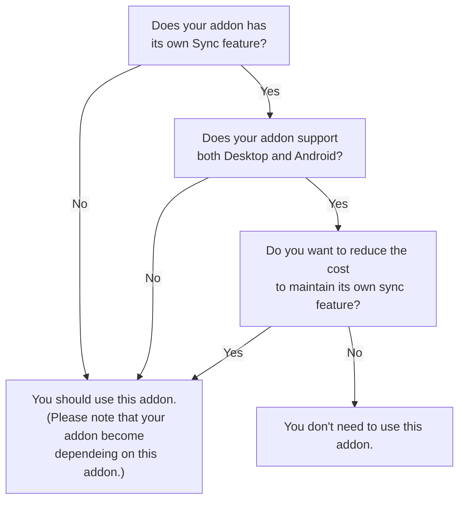

# Send Tabs to Device Simulator

This is a Firefox addon to send/receive tabs and other messages between devices, based on WebExtensions API's sync storage.

## Motivation

Firefox does not allow addons to send pages to other devices via Firefox Sync (See also [1417183 - Provide a web extensions API-based way to send pages between devices](https://bugzilla.mozilla.org/show_bug.cgi?id=1417183).)
Thus, some addons having demand to simulate Firefox's native features like Tree Style Tab need to simulate the "Send Tabs to Device" feature with `storage.sync`.
But there is a problem: such addons cannot send tabs to Android devices, if the addon does not support Firefox for Android aka Fenix.

Addons for Fenix have many restrictions, so some addons cannot support both Firefox (on desktop PC environments) and Fenix.
This project aims to provide a small addon supporting both Desktop and Android, and providing APIs for other addons to send tabs between devices.

## Do you need to use this addon?

