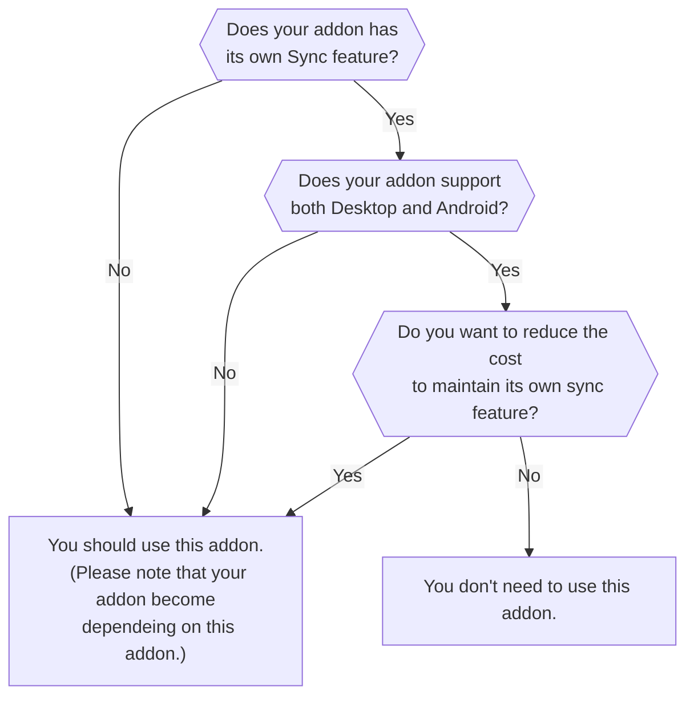

# Send Tabs to Device Simulator

This is a Firefox addon to send/receive tabs and other messages between devices, based on WebExtensions API's sync storage.

## Motivation

Firefox does not allow addons to send pages to other devices via Firefox Sync (See also [1417183 - Provide a web extensions API-based way to send pages between devices](https://bugzilla.mozilla.org/show_bug.cgi?id=1417183).)
Thus, some addons having demand to simulate Firefox's native features like Tree Style Tab need to simulate the "Send Tabs to Device" feature with `storage.sync`.
But there is a problem: such addons cannot send tabs to Android devices, if the addon does not support Firefox for Android aka Fenix.

Addons for Fenix have many restrictions, so some addons cannot support both Firefox (on desktop PC environments) and Fenix.
This project aims to provide a small addon supporting both Desktop and Android, and providing APIs for other addons to send tabs between devices.

## Do you need to use this addon?



## API for other addons

### Common

#### Get devices information

```javascript
const SEND_TABS_SIMULATOR_ID = 'send-tabs-to-device-simulator@piro.sakura.ne.jp';
const devices = await browser.runtime.sendMessage(SEND_TABS_SIMULATOR_ID, { type: 'list-devices' });
/*
devices ==
  [
    { id:        "device-1703208629205-41500",
      platform:  "Windows",
      name:      "Firefox on Windows",
      icon:      "device-desktop",
      myself:    true,
      timestamp: 1703492610680 },
    { id:        "device-1703492776144-12236",
      platform:  "Android",
      name:      "Firefox on Android",
      icon:      "device-mobile",
      myself:    false,
      timestamp: 1703492776418 }
  ]
*/
```

#### Register your addon to this addon

You need to register your addon to this addon, to receive some notification type messages.

```javascript
const succeeded = await browser.runtime.sendMessage(SEND_TABS_SIMULATOR_ID, { type: 'register-self' });
```

#### Unregister your addon from this addon

You can unregister your addon from the known addons list in this addon.

```javascript
const succeeded = await browser.runtime.sendMessage(SEND_TABS_SIMULATOR_ID, { type: 'unregister-self' });
```

#### Detect newly connected other device

This kind messages are delivered to your addon only when your addon is already registered.

```javascript
browser.runtime.onMessageExternal.addListener((message, sender) => {
  switch (sender.id) {
    case SEND_TABS_SIMULATOR_ID:
      switch (message.type) {
        case 'device-added':
          console.log('NEW OTHER DEVICE IS ADDED: ', {
            id:        message.device.id,
            platform:  message.device.platform,
            name:      message.device.name,
            icon:      message.device.icon,
            timestamp: message.device.timestmap,
          });
          break;
      }
      break;
  }
});
```

#### Detect updatings of a known device

This kind messages are delivered to your addon only when your addon is already registered.

```javascript
browser.runtime.onMessageExternal.addListener((message, sender) => {
  switch (sender.id) {
    case SEND_TABS_SIMULATOR_ID:
      switch (message.type) {
        case 'device-updated':
          console.log('DEVICE IS UPDATED: ', {
            id:        message.device.id,
            platform:  message.device.platform,
            name:      message.device.name,
            icon:      message.device.icon,
            timestamp: message.device.timestmap,
          });
          break;
      }
      break;
  }
});
```

#### Detect disconnection of a known device

This kind messages are delivered to your addon only when your addon is already registered.

```javascript
browser.runtime.onMessageExternal.addListener((message, sender) => {
  switch (sender.id) {
    case SEND_TABS_SIMULATOR_ID:
      switch (message.type) {
        case 'device-removed':
          console.log('DEVICE IS REMOVED: ', {
            id:        message.device.id,
            platform:  message.device.platform,
            name:      message.device.name,
            icon:      message.device.icon,
            timestamp: message.device.timestmap,
          });
          break;
      }
      break;
  }
});
```

### Sender side

#### Send tabs to a specific device

```javascript
const multiselectedTabs = await browser.tabs.query({ highlighted: true });
const succeededWithTabs = await browser.runtime.sendMessage(SEND_TABS_SIMULATOR_ID, {
  type: 'send-tabs',
  to:   'device-1703208629205-41500', // device ID
  tabs: multiselectedTabs,
});
const succeededWithTabIDs = await browser.runtime.sendMessage(SEND_TABS_SIMULATOR_ID, {
  type: 'send-tabs',
  to:   'device-1703208629205-41500', // device ID
  tabIds: multiselectedTabs.map(tab => tab.id),
});

/*
succeeded == true (success) or false (failure)
*/
```

Please note that the returned value `true` does not mean tabs are successfully sent.
For example it will become `true` even if there is no such device specified with the ID.

#### Send a generic message to a specific device

```javascript
const succeeded = await browser.runtime.sendMessage(SEND_TABS_SIMULATOR_ID, {
  type: 'send-message',
  to:   'device-1703208629205-41500', // device ID
  body: { // arbitrary JSONable object
    message: 'Hello, world!'
  },
});
/*
succeeded == true (success) or false (failure)
*/
```

Please note that the returned value `true` does not mean the message is successfully sent.
For example it will become `true` even if there is no such device specified with the ID.

### Receiver side

#### Receive tabs from other devices

```javascript
browser.runtime.onMessageExternal.addListener((message, sender) => {
  switch (sender.id) {
    case SEND_TABS_SIMULATOR_ID:
      switch (message.type) {
        case 'tabs-received':
          console.log('TABS ARE RECEIVED ', {
            from:      message.from, // ID of the sender device
            to:        message.to, // ID of the receiver device, regularly it means myself.
            timestamp: message.timestamp, // when the message was sent
            tabs:      message.tabs, // an array of tabs.Tab
          });
          const allowed = window.confirm('Do you really receive tabs from another device?');
          return Promise.resolve(allowed);
      }
      break;
  }
});
```

If your addon returns `false` explicitly by the listener, then this addon won't open received tabs.
Otherwise tabs are opened on the device.

You don't need to register your addon before receiving tabs.
Messages will be notified to your addon, if any tabs are sent from another device.

#### Receive generic messages from other devices

```javascript
browser.runtime.onMessageExternal.addListener((message, sender) => {
  switch (sender.id) {
    case SEND_TABS_SIMULATOR_ID:
      switch (message.type) {
        case 'message-received':
          console.log('NEW MESSAGE ', {
            from:      message.from, // ID of the sender device
            to:        message.to, // ID of the receiver device, regularly it means myself.
            timestamp: message.timestamp, // when the message was sent
            body:      message.body, // arbitrary JSONable object sent from the sender device
          });
          break;
      }
      break;
  }
});
```

You don't need to register your addon before receiving messages.
Messages will be notified to your addon, if any tabs are sent from another device.

